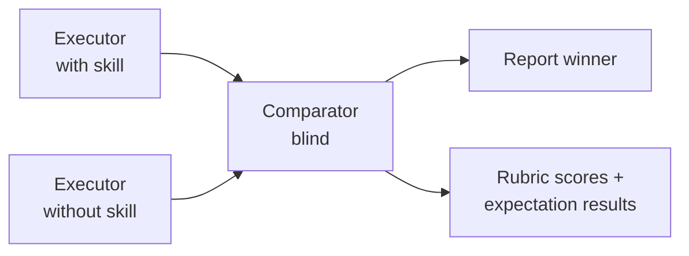

So Anthropic just updated skill-creator — the thing you use to build skills for Claude Code and Claude.ai. The update is basically: you can now *test* your skills. Like, actually test them. Not "try it and see if it looks right" — proper evals with pass/fail, benchmarks, and even blind A/B comparisons.

Quick context if you're new to the term: an "eval" is just a test case. You give AI a specific input, describe what the output should look like, and check whether it passes. Same idea as a teacher grading an exam — here's the question, here's what a good answer includes, did the student hit the marks? That's it. Evals for skills just means: testing whether your skill does what you built it to do.

## The problem this solves

Up until now, building a skill was pure vibes. You'd write a SKILL.md, try it a few times, go "yeah that seems to work," and move on. Then a new model drops, or you tweak something, and the skill silently breaks. You'd never know.

There was no way to regression-test a skill. No way to measure if it actually triggers when it should. No way to compare "version A vs version B" of a skill and know which is better.

That's what this update fixes.

![[excalidraw_2.png 10-49-59-685.png]]
## The two types of skills (and why this matters for testing)

Anthropic makes a useful distinction here:

**Capability uplift** — skills that teach Claude something it can't do well on its own. PDF form filling, handling concurrency in a programming language its unfamiliar with, that kind of thing. The skill has techniques baked in that beat raw prompting.

**Encoded preference** — skills where Claude already knows how to do each step, but the skill sequences them *your* way. An NDA review checklist, a weekly report template, a deploy workflow.

The testing angle is different for each. 

1. Capability skills might become unnecessary as models get smarter — evals tell you when the base model has caught up and you can retire the skill. 
2. Preference skills are more durable, but evals make sure the workflow still matches what you actually want.

![[images/skill-evals/testing-angle/excalidraw_2.png]]

This ties back to [[self-improving skills|the self-improving skills concept]] — if you update the SKILL.md after each run, you now have a way to verify the "improvement" actually improved something instead of just trusting it.

```
CAPABILITY UPLIFT                ENCODED PREFERENCE
────────────────                 ──────────────────
Teaches Claude new tricks        Sequences existing abilities your way

Examples:                        Examples:
• PDF form filling               • NDA review checklist
• OCR with positioning           • Weekly report from MCPs
• Complex doc generation         • Code review workflow

Test to see if the model         Test to see if the workflow
has caught up (retire skill)     still matches your process
```


![[images/skill-evals/skill-types/excalidraw_2.png]]

## Testing output quality (evals + benchmarks + blind A/B)

The first system answers: "Does my skill actually produce good output?"

Think unit tests but for prompts. You write test cases — a prompt, optionally some files, and a description of what "good" looks like. Run them, get pass/fail with timing and token counts.

Real example from Anthropic: their PDF skill couldn't handle non-fillable forms. Claude had to guess coordinates for text placement with no form fields to guide it. Evals caught it, they fixed the positioning logic, done. Without evals that's just a vague "PDFs sometimes look wrong" bug. With evals it's a specific, reproducible failure.

Under the hood, an executor agent runs your skill on each test task and captures the full transcript plus output files. Then a **grader agent** evaluates each of your assertions as pass or fail with *cited evidence* — not vibes.

For A/B comparisons, it goes further: two executors run in parallel (one with skill, one without), outputs get labeled "A" and "B" and handed to a blind **comparator agent**. It scores both on rubrics, picks a winner. Then an **analyzer agent** unblinds the results and figures out *why* the winner won — with prioritized suggestions for improving the losing version.




![[images/skill-evals/ab-testing-flow/excalidraw_2.png]]

Everything gets aggregated into benchmark stats: mean, standard deviation, min, max for pass rate, time, and tokens. With deltas so you see exactly what the skill costs vs. what it buys you:

```
Benchmark: pdf · Claude Sonnet 4.5 · 2026-02-27

                            WITH SKILL           WITHOUT SKILL
Eval                        Pass  Time  Tokens   Pass  Time  Tokens
──────────────────────────────────────────────────────────────────────
fill-nonfillable-form        ✓    4.2s  2,847     ✗    3.8s  2,102
extract-tables-multipage     ✓    6.8s  4,102     ✓    7.1s  3,890
merge-and-bookmark           ✓    3.1s  1,956     ✓    3.3s  1,721
fill-fillable-w-validation   ✓    5.9s  3,211     ✗    5.2s  2,845
ocr-scanned-to-searchable    ✓    8.4s  5,088     ✗    9.1s  4,602
──────────────────────────────────────────────────────────────────────
Pass rate                   5/5 (100%)           2/5 (40%)
```

![[images/skill-evals/benchmark-table/excalidraw_2.png]]

~13% more tokens, but pass rate goes from 40% to 100%. Three of those five tests *only* pass with the skill loaded. That's how you know the skill is actually doing something.

This connects to [[skills vs subagents|the scaling problem we've talked about]] — once you have 30-40+ skills, Claude starts picking the wrong one. Now you can actually *measure* that degradation.

**But here's something the blog doesn't really address.** The A/B benchmark asks "which output is better?" For most skills people are actually building, that's the wrong question.

Here's an example. Say you work at an insurance company and you've built a skill that triages incoming claims. It reads the submission, categorizes severity, flags missing documentation, and routes to the right department. Your company requires that any claim over $10k includes a police report — if it's missing, the skill must flag it. Claims with injury require medical documentation. Property claims get routed to a different team than auto claims.

Now run the A/B benchmark — Claude *without* the skill will still produce a perfectly reasonable triage. It might even read more naturally. The benchmark says "tie" or maybe even "no skill wins." But that completely misses the point.

You don't care if Claude's freestyle triage is more eloquent. You care: did it catch the missing police report on the $15k claim? Did it flag that the injury claim has no medical docs attached? Did it route the property claim to property, not auto? Did it categorize severity correctly using *your* company's scale, not some generic one?

That's a different kind of test. You're not comparing quality — you're verifying compliance. "Did it follow my rules?" Not "did it produce something good?"

So for procedural skills — which is most skills — skip the A/B baseline entirely. Write assertions that check *process*, not *output*:

```
CAPABILITY EVALS                    PROCEDURAL EVALS
────────────────                    ────────────────
"Which output is better?"           "Did it follow my rules?"

• PDF fields filled correctly       • Flagged missing police report (>$10k)
• Table columns preserved           • Flagged missing medical docs (injury)
• OCR positioning accurate          • Routed to correct department
                                    • Used company severity scale, not generic
```

![[images/skill-evals/capability-vs-procedural-evals/excalidraw_2.png]]

One genuine gap here: there's no structured way to test *sequencing* yet — "did it check documentation completeness *before* routing?" You'd need the execution trace, not just the final output. For now you eyeball that in the eval viewer. But even without sequencing, process assertions catch most of what matters.

## Testing trigger accuracy (description optimization)

The second system answers: "Does Claude even pick up my skill when it should?"

It takes your list of test queries — some that *should* trigger the skill, some that *shouldn't* — and splits them into a training set and a held-out test set. Like machine learning.

For each query, it fires up a fresh Claude session and stream-parses the response in real time. The moment Claude starts calling the Skill tool, it checks if it's calling *your* skill. Each query runs multiple times in parallel to get a trigger *rate* — "triggered 2 out of 3 times" means a flaky description, not a pass.

If queries fail, it calls Claude through the API with extended thinking, feeds it the failures, the full skill content, and every previous attempt — then asks for a better description. Key trick: it only shows the *training* failures. Test set stays hidden so it can't overfit.

Then it loops. New description, re-run all queries, check again. Up to five iterations. Picks whichever description scored best on the *test* set. Opens a live HTML report that auto-refreshes so you can watch it converge.

It's genuinely using ML principles — train/test split, holdout validation, iterative optimization — applied to prompt engineering instead of model weights.

![[images/skill-evals/trigger-loop/excalidraw_3.png]]

Anthropic ran this on their own document skills and saw improvements on 5 out of 6:

```
Skill Description Optimization — Test Scores (held-out prompts)

Skill                    Old      New
─────────────────────────────────────
pdf                      6/8      7/8
docx                     3/7      5/7    ← big jump
pptx                     5/8      6/8
xlsx                     6/8      8/8    ← perfect
product-self-knowledge   6/12     10/12  ← massive jump
```

![[images/skill-evals/description-optimization/excalidraw_1.png]]

xlsx went from 75% to 100%. product-self-knowledge from 50% to 83%. Just from better descriptions.

## Demo: testing an SEO audit skill end to end

> [SCREEN RECORDING — Claude Code terminal]

Let's say I used built a skill that audits any webpage for SEO issues. Not generic "you should add keywords" advice — a proper checklist. Title tag length, H1 hierarchy, image alt text coverage, internal vs external link ratio, missing schema markup, mobile viewport issues. It follows a specific priority order: critical issues first, nice-to-haves last.

I've been using it for a few weeks and it *seems* to work. But does it? Let's find out.

**Step 1: Ask skill-creator to write evals.**

> "Write evals for my seo-audit skill"

Skill-creator reads the SKILL.md, asks what kinds of pages I typically audit, then generates `evals/evals.json` with 3 test cases:
- A blog post with decent SEO but missing schema markup and some images without alt text
- A landing page that's actually well-optimized (should the skill still find things?)
- A total mess — no meta description, duplicate H1s, broken internal links, no viewport tag

That third one is important. If the skill can't catch obvious problems, nothing else matters.

**Step 2: Run the benchmark.**

> "Benchmark the seo-audit skill with and without the skill loaded"

Two subagents spin up in parallel. While they run, skill-creator asks me to define assertions:

> "What should a passing audit look like?"

I describe it: "Should score each category on a 1-10 scale. Should list issues in priority order — critical first. Should give specific fix instructions, not just 'improve your meta description.' Should check at least: title tag, meta description, H1 structure, alt text, internal links, schema, and mobile viewport."

**Step 3: Grading happens automatically.**

The grader checks each assertion against both outputs:

```
                            WITH SKILL    WITHOUT SKILL
Scores each category 1-10      ✓              ✗
Priority-ordered issues         ✓              ✗
Specific fix instructions       ✓              ✓
Checks all 7 required areas     ✓              ✗
Catches the duplicate H1s       ✓              ✓
Catches missing schema          ✓              ✗
───────────────────────────────────────────────
Pass rate                      6/6            2/6
```

Without the skill, Claude gives decent SEO advice — but it's unstructured, skips the scoring rubric, doesn't prioritize, and misses schema entirely. The skill enforces the process. This is a textbook encoded preference skill — Claude *can* do SEO analysis, the skill just makes it do it *your* way.

**Step 4: Review in the viewer.**

> [SHOW BROWSER — localhost:3117]

The eval viewer shows both outputs side by side for each test page. I notice the "well-optimized page" test case — the skill still finds 3 minor issues but gives it an 8/10. Good, it doesn't just rubber-stamp clean pages. But the fix instructions for the blog post are too vague on the alt text section. I leave feedback: "List every image missing alt text by filename, don't just say '4 images lack alt text.'"

Click "Submit All Reviews."

**Step 5: Iterate.**

> "Improve the skill based on the feedback"

Skill-creator reads the feedback, updates the SKILL.md to require per-image alt text reporting, re-runs as `iteration-2/`. The alt text section now lists each image by filename with a suggested alt text. Pass rate holds at 6/6, and the feedback issue is resolved.

**Step 6: Optimize the trigger description.**

Now the output is solid, but will Claude actually *use* this skill when someone asks for an SEO audit? And more importantly — will it *not* fire when someone says "write me SEO-friendly copy"? Different task entirely.

> "Optimize the description for my seo-audit skill"

The optimization loop runs. It generates test queries:
- *Should trigger:* "audit this page for SEO," "check the SEO on my homepage," "what SEO issues does this URL have"
- *Should NOT trigger:* "write SEO-friendly copy for my landing page," "what keywords should I target," "help me with Google Ads"

After 3 iterations, trigger accuracy goes from 7/10 to 10/10 on the held-out test set. The original description was too broad — it was catching keyword research queries. The optimized description specifies "technical SEO audit of existing pages" which keeps it in its lane.

**That's the full loop.** Write → eval → grade → review → improve → repeat. Then lock down the trigger. The skill went from "seems to work" to "passes 6 assertions across 3 test pages with 100% trigger accuracy."

## The bigger picture

Anthropic kind of buries the lede in the blog: right now a SKILL.md tells Claude *how* to do something. But evals describe *what* good output looks like. As models get smarter, the gap between "what" and "how" shrinks.

Eventually the eval might *be* the skill. You just describe what you want, and the model figures out how. The eval framework is building that bridge.

This also connects back to the [[context engineering]] idea — your CLAUDE.md files, your skills, your hooks — they're all part of the same system. Evals are the missing feedback loop that lets you actually iterate on that system with data instead of gut feel.

For now: if you're building skills, add evals. Takes five minutes. Turns "seems to work" into "I know it works." And when the next model drops, you'll know immediately if anything broke.

![[images/skill-evals/bigger-picture/excalidraw_1.png]]